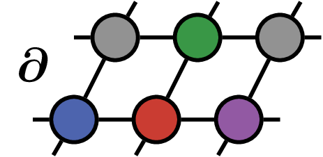

<!-- # TensorNetworkAD -->

 </img>
<h1>TensorNetworkAD</h1>

This is a repository for the _Google Summer of Code_ project on Differentiable Tensor Networks.
It is a work in progress and will **change substantially this summer (2019)** - no guarantees can be made.

The goal is to implement the algorithms described in [Differentiable Programming Tensor Networks](https://arxiv.org/abs/1903.09650), namely implementing _automatic differentiation_ (AD) on _Corner Transfer Matrix Renormalization Group_ (CTMRG) and _Tensor Renormalization Group_ (TRG),
demonstrating two applications:
- Gradient based optimization of iPEPS
- Direct calculation of energy densities in iPEPS via derivatives of the _free energy_

More generally we aim to provide Julia with the tools to combine AD and tensor network methods.

Suggestions and Comments in the _Issues_ are welcome.

## License
MIT License
